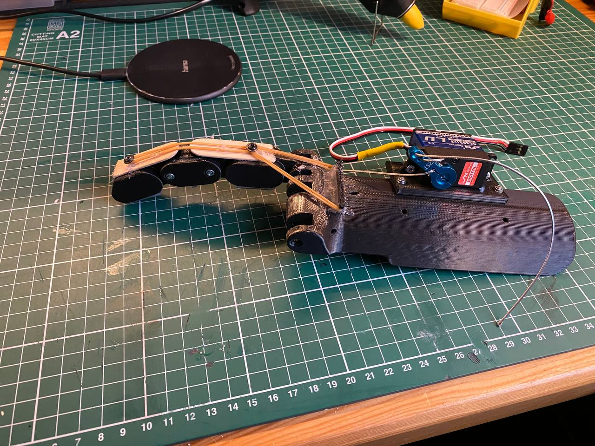
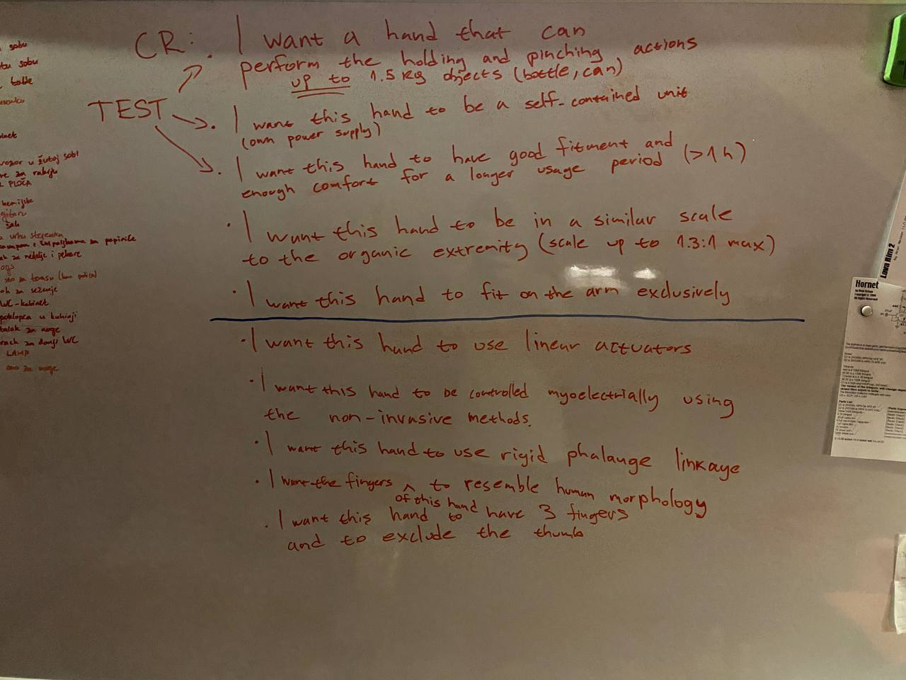
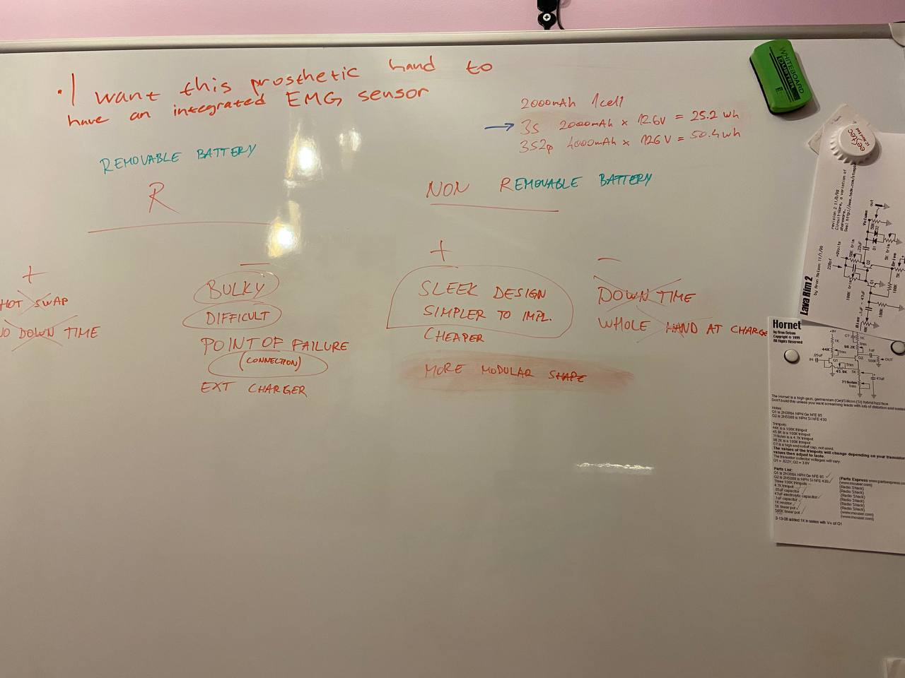
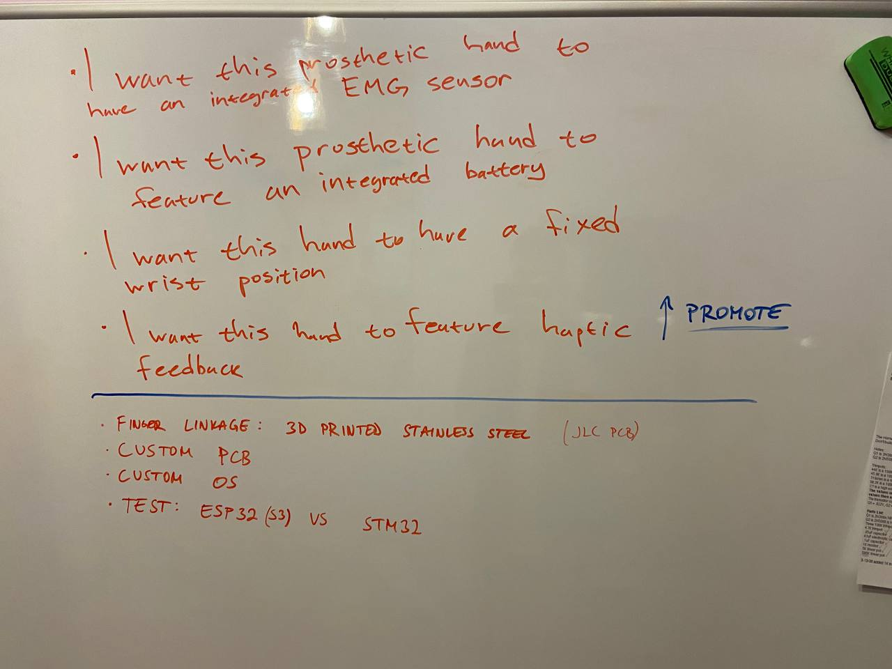
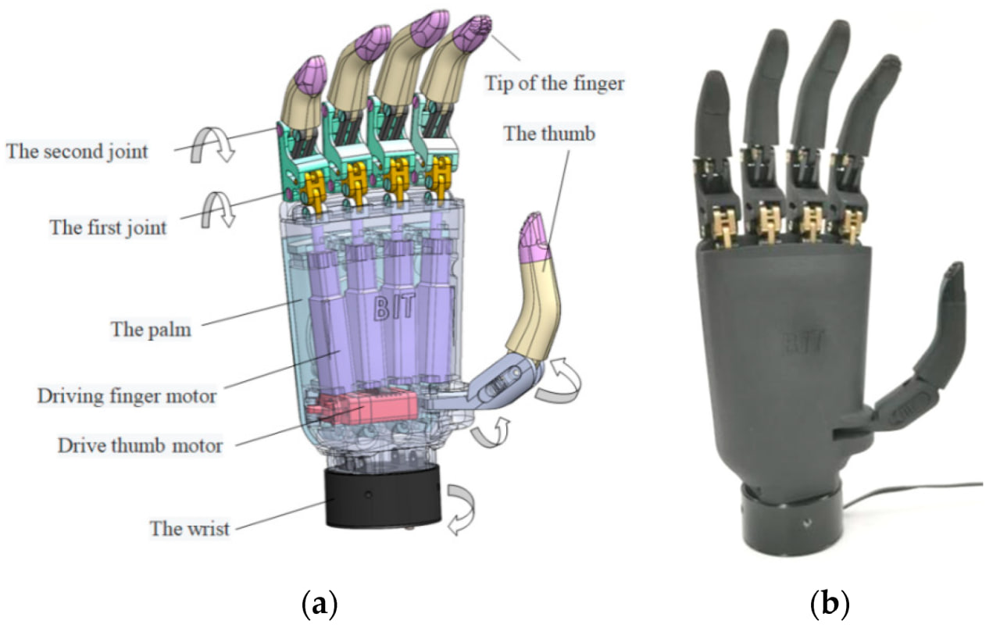

# ProstheticHand
 
Our attempt at a prosthetic hand using ESP32 S3 microcontroller with EMG sensor.

## Proof of concept

For proof of concept, we measure bicep activation because it seemed the simplest muscle to use. Using the EMG sensor we could get some useful waveforms and filter them with both HW and SW low-pass filter. Also we made some simple 3D printed fingers and connected them with wire to servo motor, and the hand could actually move and be controlled using muscle activation.

Some images of the POC:

See a video of the hand being operated by a potentiometer [here](images/poc/poc_finger_test.mp4).

See a video of EMG sensor actuating a servo [here](images/poc/poc_emg_sensor_test.mp4).

## Minimum Viable Product (MVP)

Here are the pictures of the whiteboard and an example hand we had in mind for first MVP (TODO: document this process and finalize plan):

