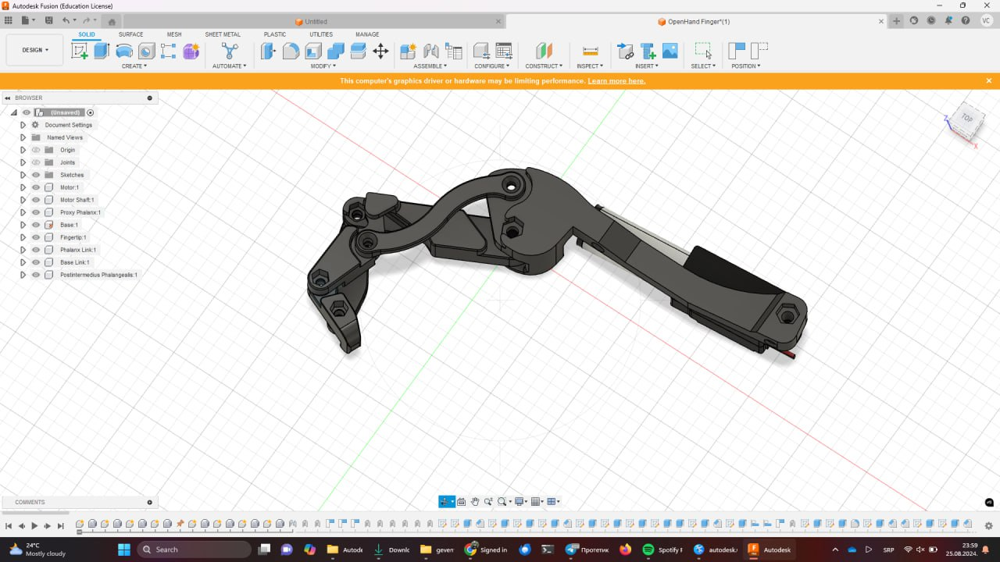
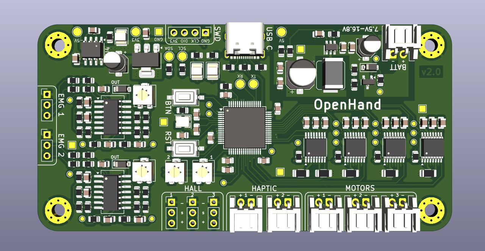
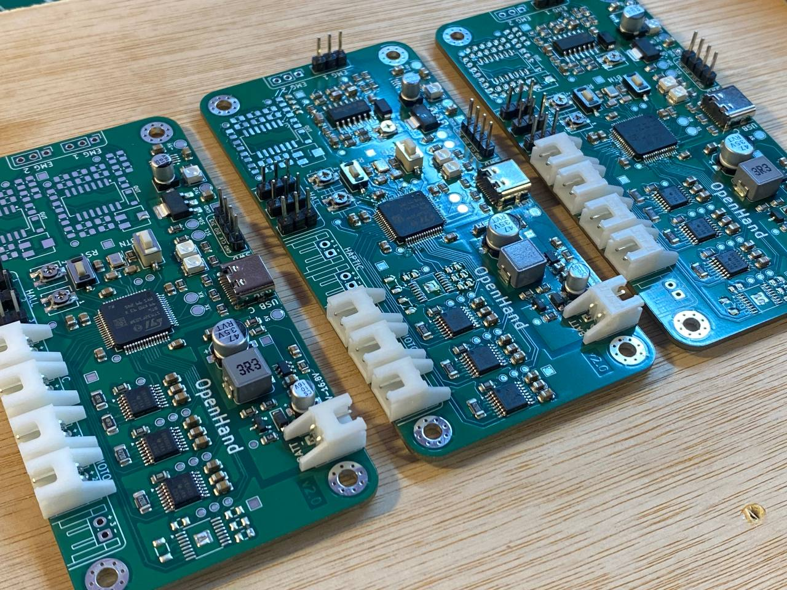
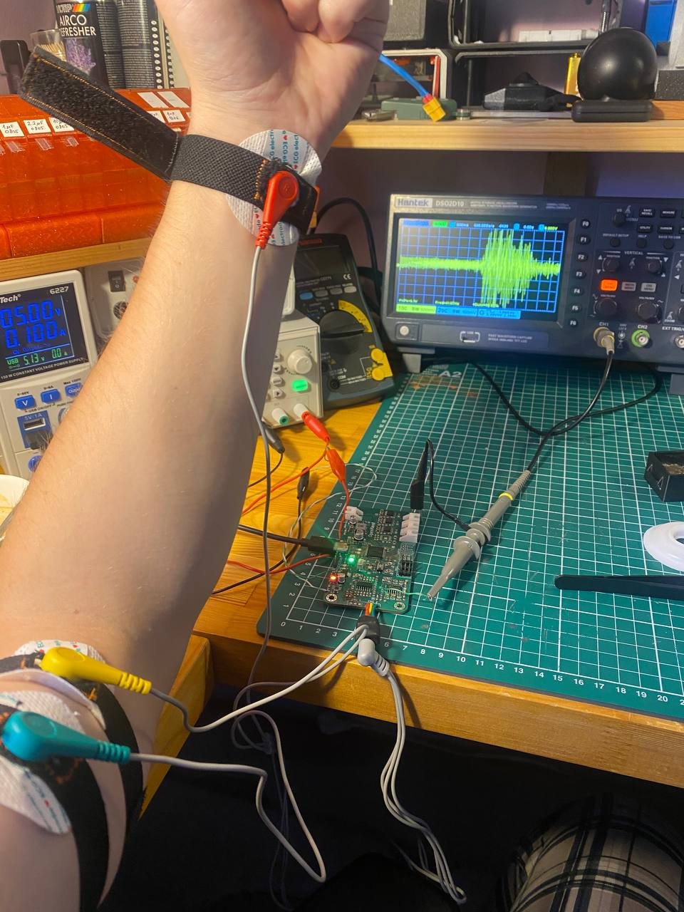
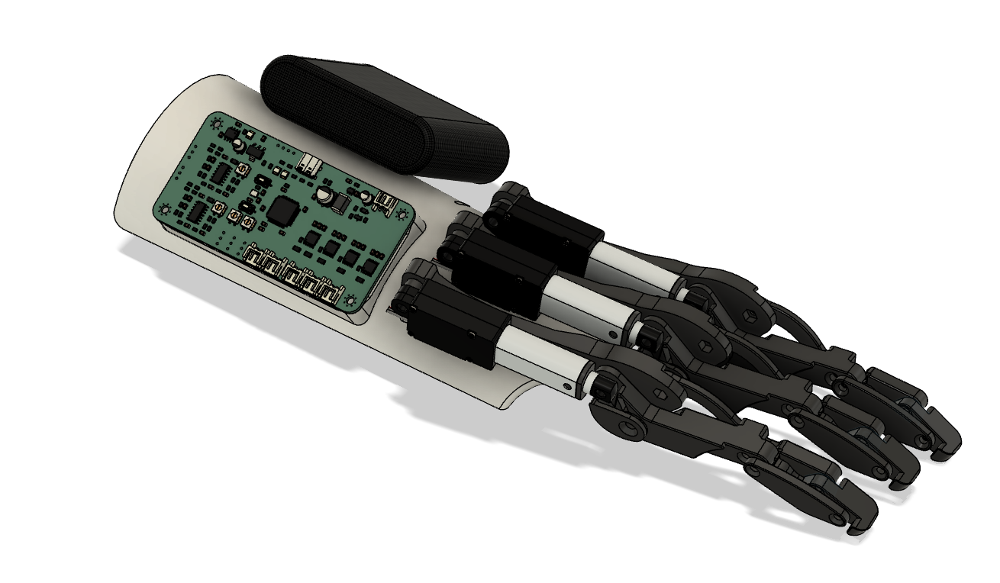
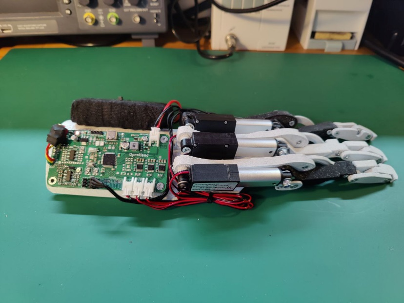
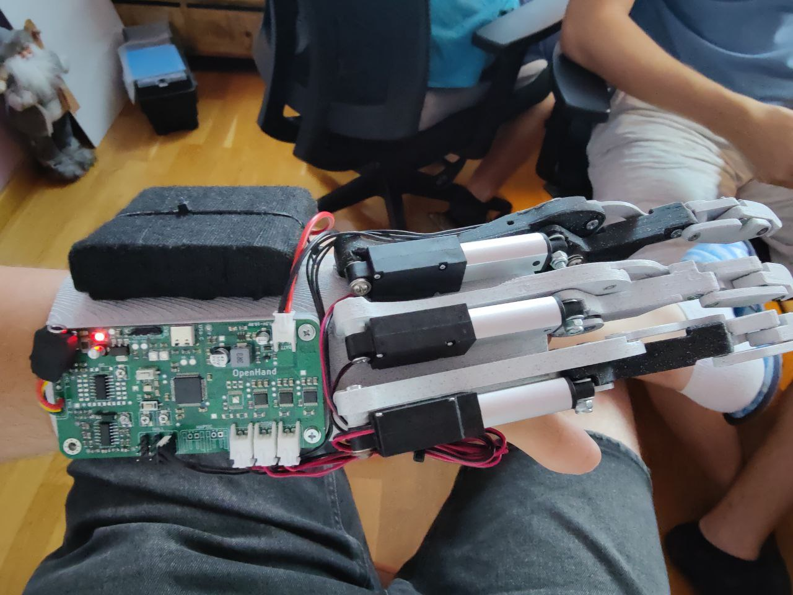
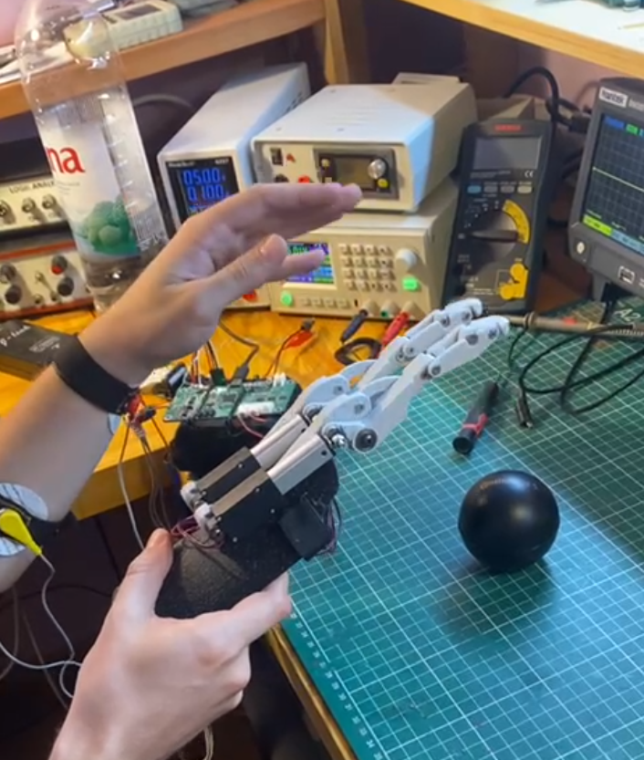
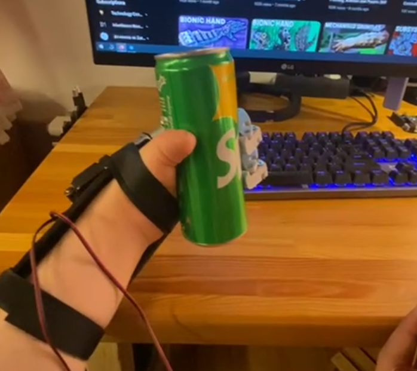
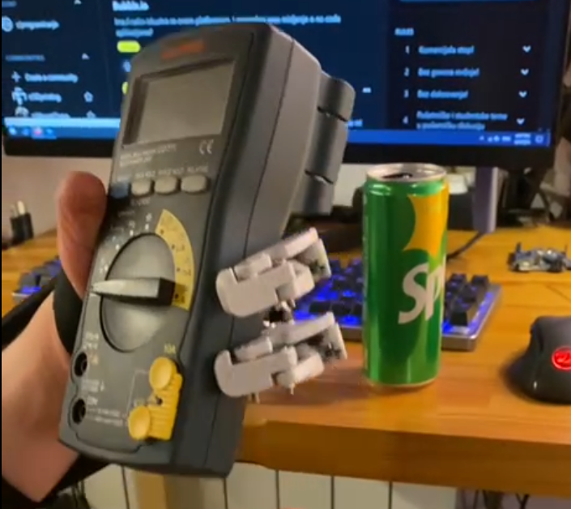

# OpenHand
 
Our attempt at a prosthetic hand controlled by muscle EMG sensors, using linear actuators to move mechanically linked fingers. Implementing our own 3D models (ME), schematic & PCB design of main control board (EE) and software solution (SW).

## Proof of concept

Our (actually second) proof of concept, is using our own PCBs with STM32, our own mechanical design, and some basic software running on STM32 reacting on button press or EMG sensor activation.

For now, this approach seems promising, and only thing left to be changed is the motors used. We use linear actuators, which seem to be exactly what we need, but for now they don't have any position feedback. To solve that we will be using motors with built-in encoders in future, and monitoring their position with STM32 HW timer functions for encoders. Preliminary testing for that worked perfectly, we could always know the position of the motor based on the encoder value, and using endstops we can also calibrate the travel, and using current limiting H bridge motor drivers, we can control the force applied. 

Here are some screenshots of the current status:

### Finger design. Completely mechanical linkage, with linear actuator

### Our custom PCB, with many components including EMG sensors, H bridge motor drivers, etc.

### Also some EMG sensor readings (before additional filtering)

### Now, the whole prototype of the hand (3D printed, batteries, PCB, 3x fingers with motors)

## Example videos of OpenHand in action

Here are some videos of the project for now. Nice to see it finally come together, although this is still early in development, and some things will be changed, and a lot of things will be made to look even prettier.

Note: you might have to download .mp4 videos if GitHub doesn't support playback in browser.

### Showing the response when EMG reading muscle activity 

### Simple demonstration of holding a bottle

### Demo: holding a can of soda

### Demo: holding a multimeter

