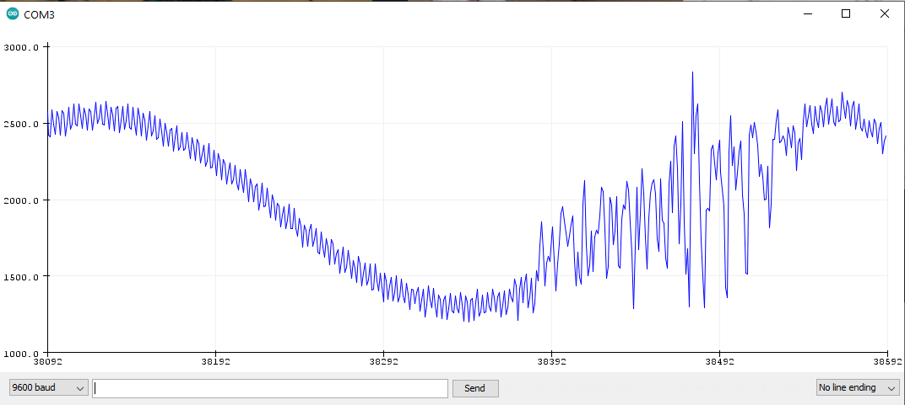
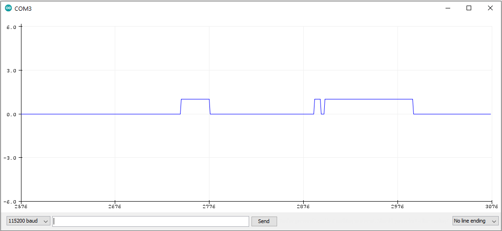

# ProstheticHand
 
Our attempt at a prosthetic hand using ESP32 microcontroller with AD8232 ECG sensor.

The sensor is supposed to be used for heartbeat but can be used for muscle activation.

 

## Proof of concept

For proof of concept, we measure bicep activation because it seemed the simplest muscle to use.

Placement of electrodes for this test:

The unfiltered raw signal from sensor looks like this:

We have both high and low frequency noises. That may be from cheap electrodes, cheap sensor, the fact we are using ECG sensor for EMG signals or poor electrode placement. Nevertheless we continue processing this signal, because if we can get data from this we can also get it from more beautiful signals. 

After applying some highpass filtering and thresholding we can get this signal:

That is now much better and we can see when the muscle is actually contracted. The next step was adding lowpass filter to this signal so there are no jagged edges and thresholding that signal to get somewhat "square wave" signal for when the muscle is active:

This of course is not perfect but is something we can use to work on other parts of system and eventually make this more robust and scalable.
