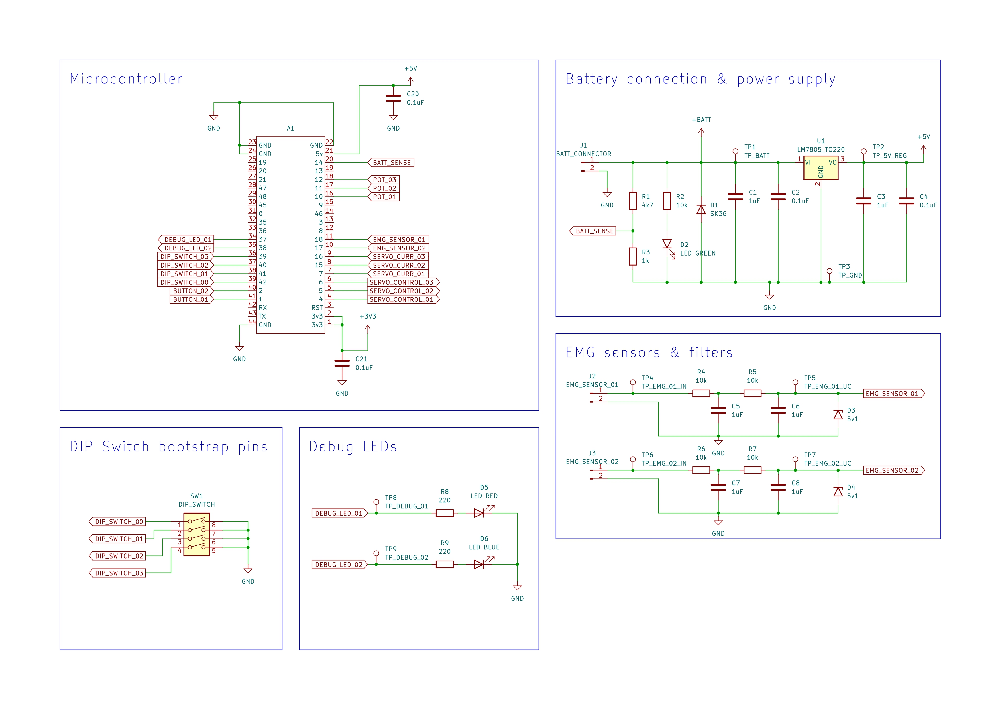
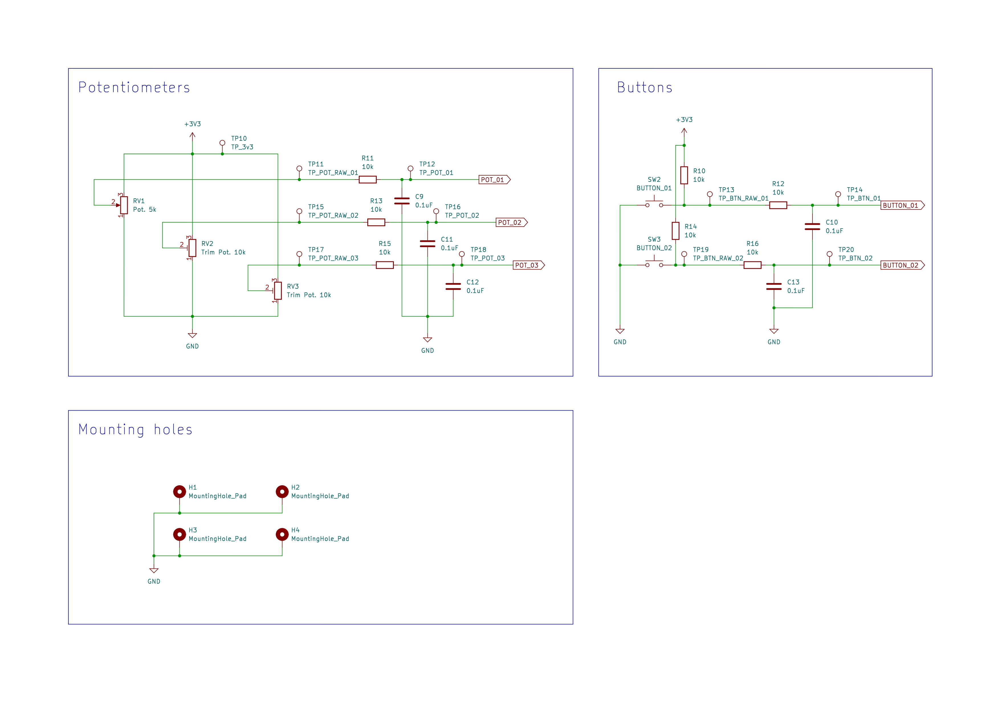
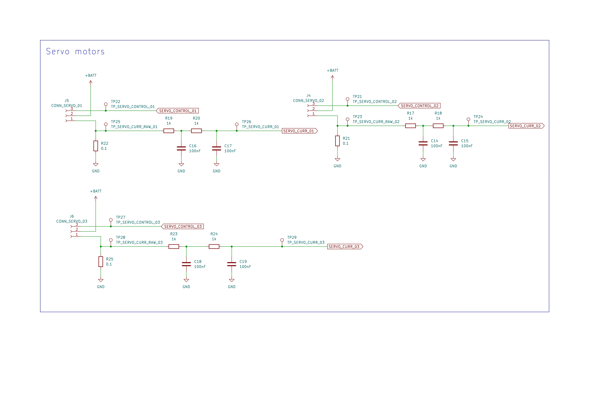
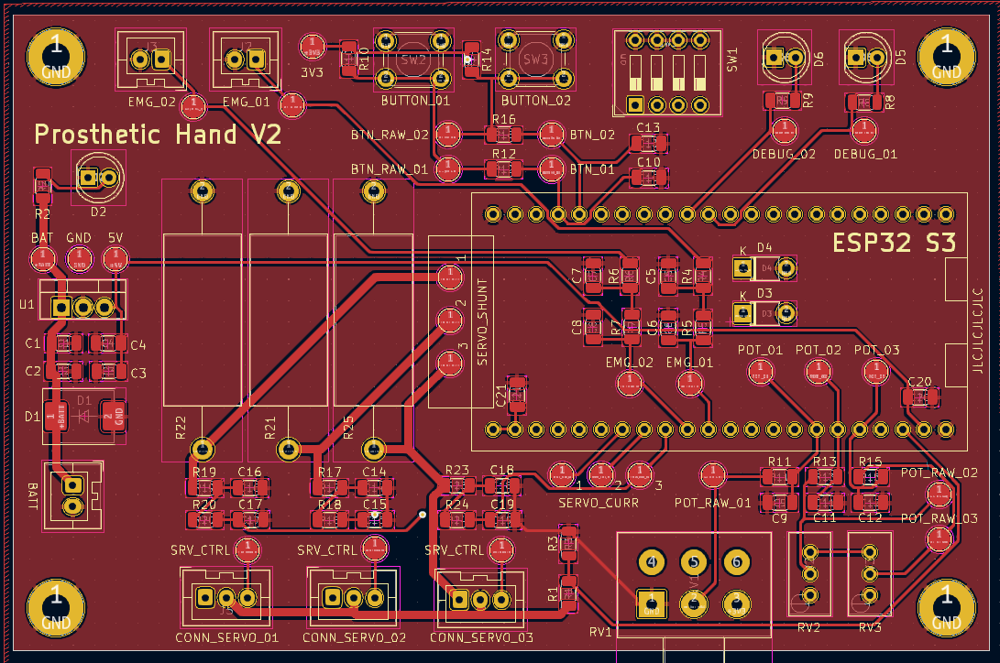
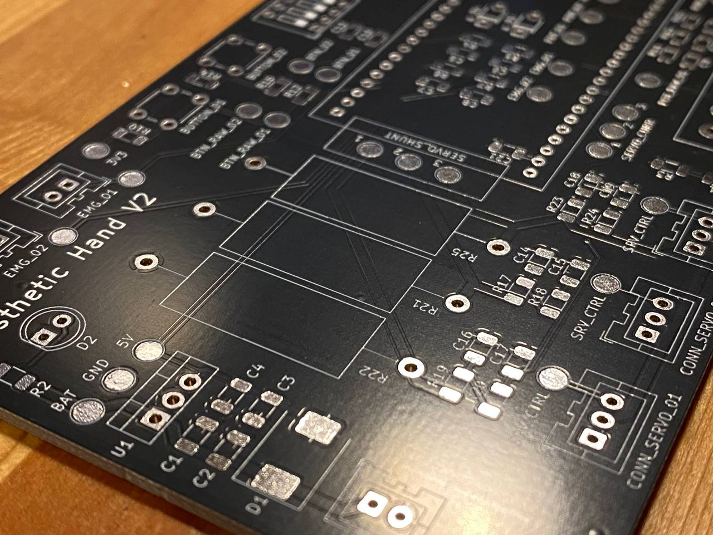
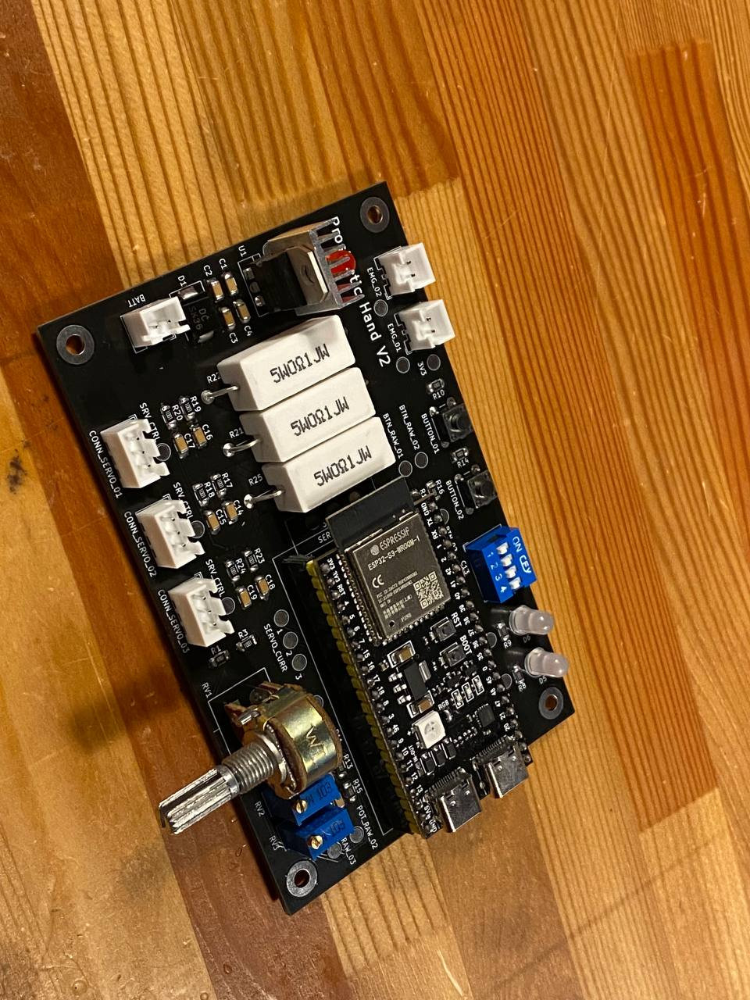
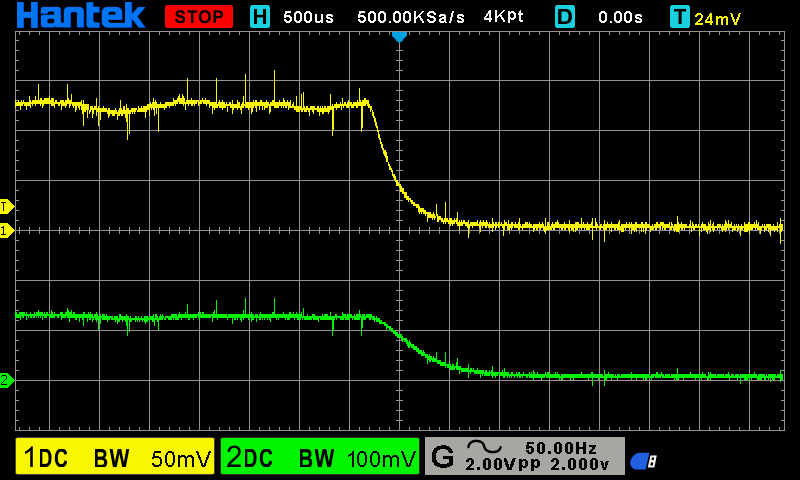
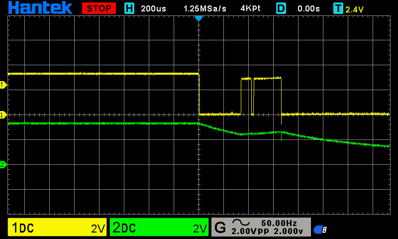

# Hardware & PCB designs of the prosthetic hand project

For designing those we use [KiCAD](https://www.kicad.org/download/). Good tutorial can be found [here](https://www.youtube.com/playlist?list=PL3bNyZYHcRSUhUXUt51W6nKvxx2ORvUQB). Although it's for a bit older version of the KiCAD it is still usefull.

## DevBoard

Firstly we haver here a development board, custom made for our purpose of having EMG sensors and servo motors connected. Also a couple of buttons/pots etc. for easier debugging/testing. Schematic can be found [here](DevBoard/schematic.pdf).

We will be using [ESP32 S3](https://api.riot-os.org/group__cpu__esp32__esp32s3.html). So in this desin, we're using the ESP32 S3 devboard, but later on we will just use the ESP32 microprocessor.

The boards will be ordered from an online PCB manufacturer, in our case JLC PCB.

DevBoard features:
 - battery/power supply connector
 - 3x servo connectors (with current sensing over 0.1 ohm shunts, and filter for current sensing signal as it is a bit noisy)
 - 2x EMG sensor connectors (signal goes trough RC low-pass filter on its way to the uC)
 - 4x dip switches for easy configuration (easily change code logic on-the go, without re-flashing the board)
 - 2x push buttons (with on-board pullups and HW debounce filter)
 - 2x trim pots and one 'normal' potentiometer (with RC low-pass filter to get rid of some noise from cheap pots)
 - 2x debug LEDs (red/green)
 - 5V regulator for the ESP32 DevBoard
 - input/battery voltage sensing
 - reverse protection diode (would be nice to upgrade to a 'smarter' variant with MOSFET later)
 - 2 layer PCB, components on one side, mix of SMD/THT components
 - a lot of test point pads on the board for all the signals

For now, this DevBoard should give us enough functionality to make some version of a working prototype, but the wishlist for the actual PCB will be updated as we come across new stuff.

### Devboard pictures

#### Schematic

#### PCB design

#### Manufactured PCB

#### Assembled PCB

### Devboard testing

#### Smoke test

When powered from a 12V power supply, the board turns on, power LED is on, nothing caught fire, microcontrollers LED flashing, debug LED flashing (as defined in code). 5V regulator (LM7805) is giving us 5V.

#### Filter testing: EMG sensor

Filter is working. On a screenshot below, channel 1 is raw signal from signal generator which we feed into EMG sensor input, and channel 2 is measured on testpoint for EMG input on the microcontroller. We have a two stage RC low-pass filter with values 10kOhm and 1uF (see shemcatic sheet 1).

#### Filter testing: Servo current

Servo motor current raw signal is looking quite awful:

Here is an example where I connected an external supply to push 1A trough the shunt resistor. Chn 1 is raw, chn 2 is filtered. We can see its filtering enough for now.

#### Filter testing: Button debounce

Similar to EMG sensor, here we see channel 1 is raw button signal, and channel 2 is filtered. We can see the filter is doing its job on and filtering the contact bouncing:

#### Filter testing: Pot debounce

I could not get the pot to give us errors (jumping to gnd of supplied voltage), so it seems the pot is good after all. Although during previous testing some pots were getting some pretty wild oscillations just by tapping them.

#### Input voltage divider

With 10V on input from a bench power supply, at battery sense voltage divider we get 9.97V as input, and output at 1.753V measured with multimeter - as expected (from calculation: 1.754V with 4k7 and 1k resistors in divider).

## Actual project PCB

Final design will still have to be made once we know exactly what we need and how to do it.

Some ideas:
 - on-board battery charger
 - on-board EMG sensor processing (from raw electrode connections)
 - some thing from devboard (trim-pots maybe, debug LEDs etc.)
 - using ESP32 S3 microchip, not the whole ESP32 development board
 - input reverse polarity protection with MOSFETs
 - connectors and drivers for linear actuators instead of servo motors (H-bridge)
 - connectors and drivers for haptic feedback (vibrating motor, similar to a console joystick vibration)
 - maybe current/power limiting for linear actuators
 - feedback loop for finger positions - maybe hall-efect sensors and magnets, will require additional connectins

