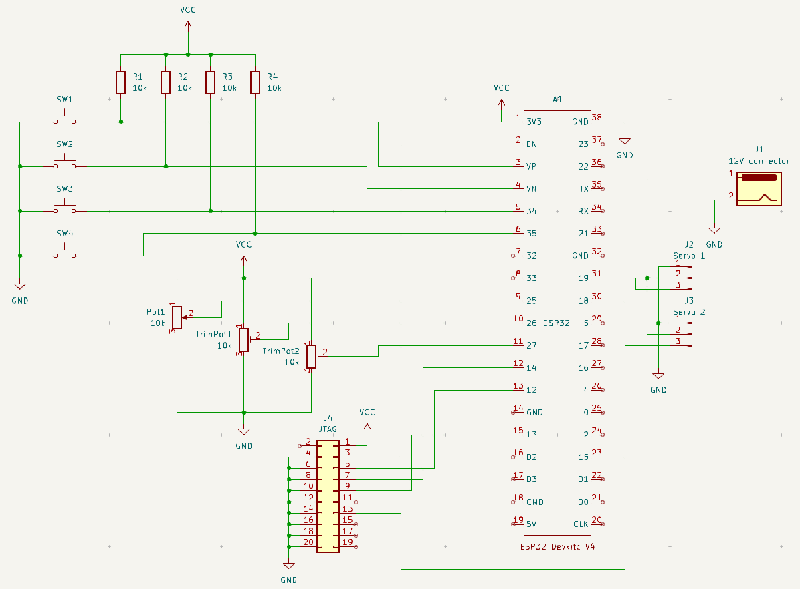
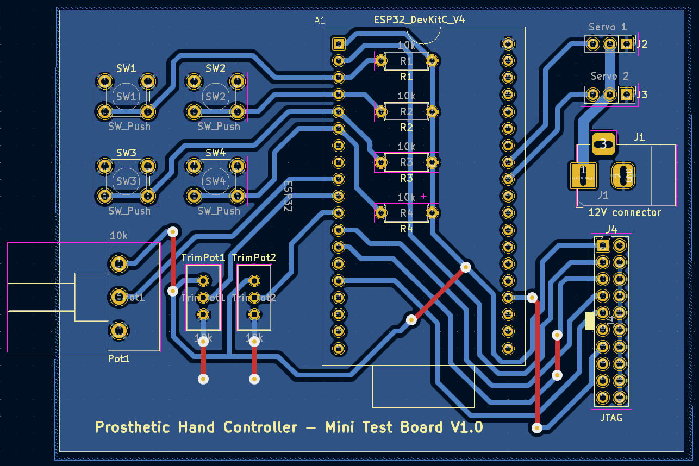
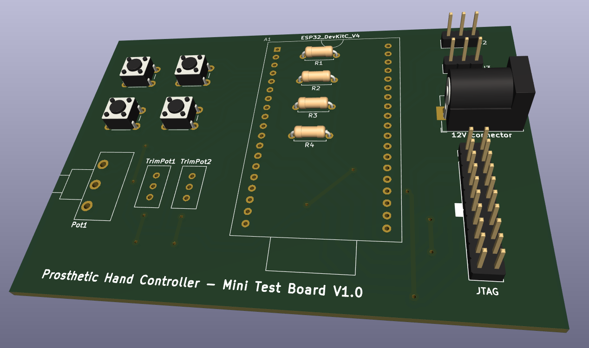

# PCB & HW designs of the prosthetic hand project

For designing those we use [KiCAD](https://www.kicad.org/download/). Good tutorial can be found [here](https://www.youtube.com/playlist?list=PL3bNyZYHcRSUhUXUt51W6nKvxx2ORvUQB). Although it's for a bit older version of the KiCAD it is still usefull.

For now only two project are here:
 - **DevelopmentBoard** - First example board to test the KiCAD software and to try our hand at making our own PCB at home (TODO: update this document with findings)
 - **ProstheticHand v1** - The actual PCB design that will be used in the prosthetic hand (for the first prototype)

Folders:
 - **images** - contains images of the PCBs and hardware
 - **libraries** - contains libraries used in KiCAD

Versioning:
 - v1.x -> first prototype, with v1.0 being the first design, and then iterating trough v1.1, v1.2...
 - v2.x -> todo

## Development Board

Here is the schematic of the development board:

It contains 4 buttons (with pullup resistors), 3 potentiometers (two trim pots, and one guitar pot), two servo connectors, JTAG connector and 12V barrel jack.

Here are some PCB screenshots:

## Prosthetic Hand v1

TODO
