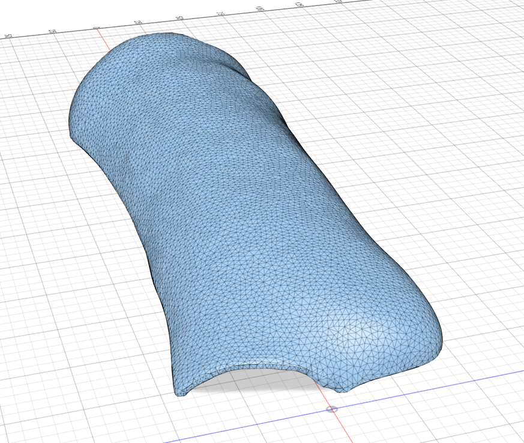
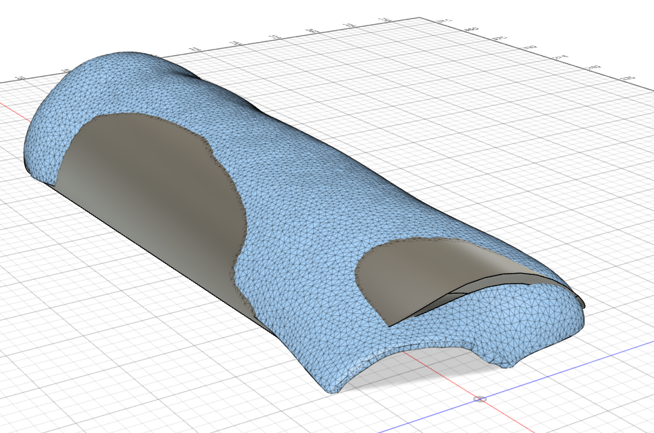

# Mechanical designs for the prosthetic hand project

## Initial design based on plaster mold of the hand

In folder **OpenHand** you can find the [Fusion360 file of the prosthetic hand](OpenHand.f3d), described below.

Here is the (somewhat modified and cleaned up) scan of the plaster/clay mold we made of the base, by pressing it over the arm:

After it is imported into Fusion 360, we can create a more basic shape following its dimensions and profile somewhat, so we will make a parametric design to be later 3D printed:

